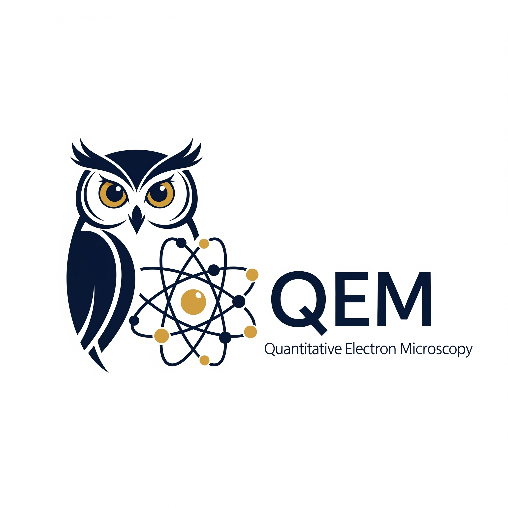

<a name="readme-top"></a>

[![Contributors][contributors-shield]][contributors-url]
[![Forks][forks-shield]][forks-url]
[![Stargazers][stars-shield]][stars-url]
[![Issues][issues-shield]][issues-url]
[![GPLv3 License][license-shield]][license-url]
<!-- [![LinkedIn][linkedin-shield]][linkedin-url] -->


<!-- PROJECT LOGO -->
<br />
<div align="center">
  <a href="https://github.com/zezhong-zhang/qem">
    
  </a>

  <h3 align="center">QEM</h3>

  <p align="center">
    Quantitative Electron Microscopy
    <br />
    <!-- <a href="https://qem.readthedocs.io/en/latest/"><strong>Explore the docs »</strong></a> -->
    <br />
    <br />
    <a href="https://github.com/zezhong-zhang/qem/tree/master/examples">View Demo</a>
    ·
    <a href="https://github.com/zezhong-zhang/qem/issues">Report Bug</a>
    ·
    <a href="https://github.com/zezhong-zhang/qem/issues">Request Feature</a>
  </p>
</div>


<!-- TABLE OF CONTENTS -->
<details>
  <summary>Table of Contents</summary>
  <ol>
    <li><a href="#about-the-project">About The Project</a></li>
    <li><a href="#getting-started">Getting Started</a></li>
    <li><a href="#roadmap">Roadmap</a></li>
    <li><a href="#contributing">Contributing</a></li>
    <li><a href="#license">License</a></li>
    <li><a href="#contact">Contact</a></li>
    <li><a href="#acknowledgments">Acknowledgments</a></li>
  </ol>
</details>


<!-- ABOUT THE PROJECT -->
## About The Project

<!-- [![Product Name Screen Shot][product-screenshot]](https://github.com/zezhong-zhang/qem) -->
QEM is a python version of [StatSTEM](https://github.com/quantitativeTEM/StatSTEM), aiming to provide robust, fast and user-friendly quantification for advanced microscopy. The main usage of QEM is to refine scattering cross-sections, atomic positions and number of atoms for each atomic columns. The computation is accerlated with GPU parallel computing via [JAX](https://jax.readthedocs.io/en/latest/index.html).

This repo is currently under heavy development. 

<p align="right">(<a href="#readme-top">back to top</a>)</p>


### Features

QEM currently support the following features

- [x] Global model-based parameter estimation via gradient descent
- [x] Flexibility of model choices (Gaussian, Lorentzian, Voigt, ect)
- [x] Multi-elemental column refinement with different width 
- [x] Atomic column assignment with input crystal structure and spatial mask
- [x] Displacement and strain mapping 

You can check the example tutorials in the examples

<p align="right">(<a href="#readme-top">back to top</a>)</p>


<!-- GETTING STARTED -->
## Getting Started

To get code running locally, let's first create a conda environment.

```bash
conda create -n qem python=3.11
conda activate qem
pip install -e .
cd examples
```

<p align="right">(<a href="#readme-top">back to top</a>)</p>


<!-- USAGE EXAMPLES -->


<!-- ROADMAP -->
## Roadmap
### TO-DO list
- [ ] Test the code on windows
- [ ] Improve Gaussian mixture model and selection rule
- [ ] Atom counting based on simulated library
- [ ] Better peak initization
- [ ] Perovskite polarisation, oxygen octahedron tilt and distortion
- [ ] Add documentation
- [ ] Add tests
- [ ] User-friendly GUI

See the [open issues](https://github.com/zezhong-zhang/qem/issues) for a full list of proposed features (and known issues).

<p align="right">(<a href="#readme-top">back to top</a>)</p>


<!-- CONTRIBUTING -->
## Contributing

Contributions are what makes the open-source community such an amazing place to learn, inspire, and create. Any contributions you make are **greatly appreciated**.

If you have a suggestion that would make this better, please fork the repo and create a pull request. You can also simply open an issue with the tag "enhancement".
Don't forget to give the project a star! Thanks again!

1. Fork the Project
2. Create your Feature Branch (`git checkout -b feature/AmazingFeature`)
3. Commit your Changes (`git commit -m 'Add some AmazingFeature'`)
4. Push to the Branch (`git push origin feature/AmazingFeature`)
5. Open a Pull Request

<p align="right">(<a href="#readme-top">back to top</a>)</p>


<!-- LICENSE -->
## License

Distributed under the GPLv3 License. See `LICENSE` for more information.

<p align="right">(<a href="#readme-top">back to top</a>)</p>


<!-- CONTACT -->
## Contact

Zezhong Zhang - zezhong.zhang@uantwerpen.be

Project Link: [https://github.com/zezhong-zhang/qem](https://github.com/zezhong-zhang/qem)

<p align="right">(<a href="#readme-top">back to top</a>)</p>


<!-- ACKNOWLEDGMENTS -->
## Acknowledgments

* Readme page based on [Best-README-Template](https://github.com/othneildrew/Best-README-Template)

<p align="right">(<a href="#readme-top">back to top</a>)</p>


<!-- MARKDOWN LINKS & IMAGES -->
<!-- https://www.markdownguide.org/basic-syntax/#reference-style-links -->
[contributors-shield]: https://img.shields.io/github/contributors/zezhong-zhang/qem.svg?style=for-the-badge
[contributors-url]: https://github.com/zezhong-zhang/qem/graphs/contributors
[forks-shield]: https://img.shields.io/github/forks/zezhong-zhang/qem.svg?style=for-the-badge
[forks-url]: https://github.com/zezhong-zhang/qem/network/members
[stars-shield]: https://img.shields.io/github/stars/zezhong-zhang/qem.svg?style=for-the-badge
[stars-url]: https://github.com/zezhong-zhang/qem/stargazers
[issues-shield]: https://img.shields.io/github/issues/zezhong-zhang/qem.svg?style=for-the-badge
[issues-url]: https://github.com/zezhong-zhang/qem/issues
[license-shield]: https://img.shields.io/github/license/zezhong-zhang/qem.svg?style=for-the-badge
[license-url]: https://github.com/zezhong-zhang/qem/blob/main/LICENSE
[linkedin-shield]: https://img.shields.io/badge/-LinkedIn-black.svg?style=for-the-badge&logo=linkedin&colorB=555
[linkedin-url]: https://linkedin.com/in/zezhong-zhang-062a0838
[product-screenshot]: images/screenshot.png